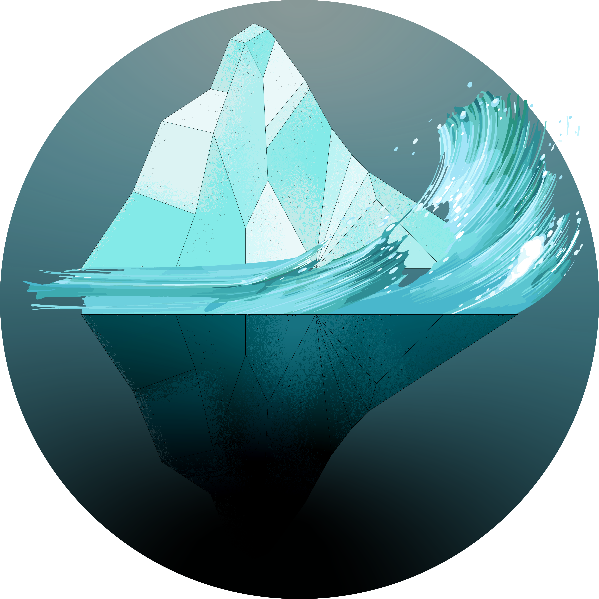

	

What is ReHitman?
---------------

ReHitman is an attempt to reverse the executable of "Hitman: Blood Money".

The final goal of the project is to develop a multiplayer similar to Mafia 2's Mutli-player.

Game Build Information.
---------------

This project is built for the last build of Hitman Blood Money that IO Interactive released.

Executable String:

	blood-build3-20060616-26123

FAQ
---------------
 * [Wiki.](https://github.com/ReGlacier/ReHitman/wiki)

Current Project Goals.
---------------

 - [x] Create an open source SDK for the Glacier 1 Engine
 - [ ] Reverse the rendering API
 - [x] Implement ImGUI backend over Glacier renderer wrapper (ZWintelRendererD3D)
 - [x] Reverse the input API (mouse, keyboard)
 - [ ] Reverse the GUI API
 - [ ] Reverse the scene format
 - [ ] Create a toolset for Hitman Blood Money

Credits
------

 * [DronCode](https://github.com/DronCode)
 * [crabovwik](https://github.com/crabovwik)
 * [Daniel Hunter](https://github.com/HHCHunter)
 * [Notexe](https://github.com/Notexe)

Contact Information.
---------------

The team can be contacted in the Project's issue tracker or via Discord (any questions, ideas, etc).

