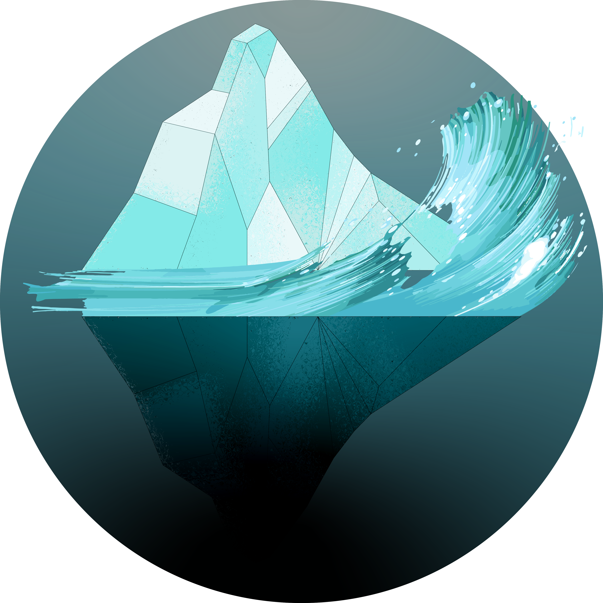

	

What is ReHitman?
---------------

ReHitman is an attempt to reverse the executable of "Hitman: Blood Money".

The final goal of the project is to develop a multiplayer similar to Mafia 2's Mutli-player.

Game Build Information.
---------------

This project is built for the last build of Hitman Blood Money that IO Interactive released.

Executable String:

	blood-build3-20060616-26123

Install
-------

 1. Download the latest release
 2. Unpack `NVCPL.dll` & `ReHitman.dll` into the game folder
 3. Launch HitmanBloodMoney.exe

Current Project Goals
---------------------

 * [ ] Glacier 1 Engine Open Source SDK — Create a base SDK for convenient engine interaction.
 * [x] Implement ImGUI backend (IO, Render (re-use D3D9 + add hooks))
 * [x] Reverse the input API (mouse, keyboard).
 * [ ] Evolve into a robust header-only SDK for seamless modding and extension development.
 * [ ] Comprehensive Engine Reverse Engineering — Decompile and reconstruct Hitman Blood Money piece by piece.
   * [ ] Reverse all classes.
     * [ ] In-game
     * [ ] Engine
   * [ ] Reimplement reversed class methods and internal logic.
   * [ ] Reimplement global and helper functions.
   * [ ] Gradually replace original engine methods with open-source implementations until the entire game loop runs natively on the new codebase.
 * [ ] Reverse & write docs for scene and asset formats.
 * [ ] Create a dedicated toolset for Hitman: Blood Money (modding, asset extraction, etc.). [In progress, see BMEdit repo]

FAQ
-----
 * [Wiki.](https://github.com/ReGlacier/ReHitman/wiki)

Credits
------

 * [DronCode](https://github.com/DronCode)
 * [crabovwik](https://github.com/crabovwik)
 * [Daniel Hunter](https://github.com/HHCHunter)
 * [Notexe](https://github.com/Notexe)

Contact Information.
---------------

The team can be contacted in the Project's issue tracker or via Discord (any questions, ideas, etc).

