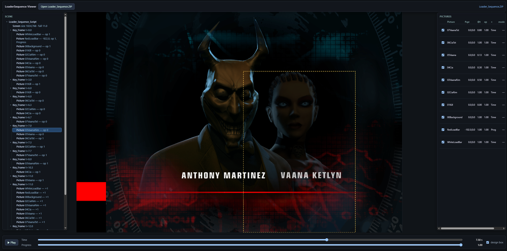

# LoaderSequence Viewer

Standalone HTML5 previewer for a scene's **Loader Sequence** — the sprite
overlay a Hitman: Blood Money level shows while it loads. It opens a
`Loader_Sequence.ZIP`, plays back the animation on a 2D canvas, and lets you
inspect the scene hierarchy. It reuses the already-reversed Glacier parsing and
layout (no engine), so it runs offline with a tiny vendored dependency.



## Quick start

Serve it via npm

```bash
npm start      # uses `python -m http.server 8000`
npm run serve  # uses `npx http-server` (auto-downloads on first run)
```

then open http://localhost:8000 and open (or drag & drop) a ZIP such as
`Examples/hideout/Loader_Sequence.ZIP`.

## What it does

1. **Container** — the `.ZIP` is a standard archive; the viewer walks the EOCD +
   central directory and inflates the `*Loader_Sequence.GMS/PRM/TEX` members
   (raw deflate, `wbits=-15`), matching `FsZip_t` / `ZIP.h`.
2. **Entity locate** — the GMS opens with a `ZPackedDataChunk` 9-byte header
   (raw-deflate or raw copy). The unzipped body is an `SPackedGeomsHeader`; the
   viewer walks the entity table (`lCompiledGeomOffset & 0xFFFFFF`, dword
   scaled) to the first `ZLoader_Sequence_Setup` (`lGeomType == 0x20011B`) and
   reads its prim payload: the NUL-terminated XML script plus the picture-name
   blob at `align4(strlen+4)`.
3. **Script** — ports the two-pass `ZLoader_Sequence_Script_Reader` (key-frame
   counting incl. the implicit frame at `t=0`, case-insensitive picture-name
   dedup, `Position="X,Y"` split) and the `ZLoader_Sequence_Script` evaluators
   (`Adjust_Script_Time`, `Get_PosX/Y/Opacity/Multiply`, Time-vs-Progress
   remap, `Interpolate_Picture_Field`). The same gtest vectors from the engine's
   `ZLoader_Sequence_Script_Reader_Tests.cpp` are checked by `_test.js`.
4. **Sprites** — ports `InstallTextureBuffer`: for each picture it resolves the
   prim shape record (`element_count`, 10-float elements, sub-offsets), keeps
   sub-records with `type == 2` and a resolvable texture id, and pulls the
   bitmap from the TEX buffer via the texture-id→offset table. The
   `ZBitmap::LoadBin` header is parsed and the payload decoded by type
   (`PAL`/`PAL_OPAC`/`32`/`I8`/`U8V8` and block `DXT1`/`DXT3`).
5. **Playback** — the timeline `t ∈ [0, Full_Progress_Time]` drives opacity /
   multiply fades; the separate **Progress** slider drives pictures authored
   with `Position_Interpolation="Progress"` (e.g. the loading wipe).

## Sprite geometry model

Each picture is a small grid of sprite quads tiling the design area. The shape
element stores a Y-up center (`element[0]`, `element[1]`) and size (`element[7]`,
`element[8]`, equal to the decoded texture size). The canvas top-left is

```
x = element[0] − texW/2
y = −element[1] − texH/2          (design space is Y-up, canvas is Y-down)
```

which matches the engine's `posX = centerX − size/2`, `posY = −centerY − size/2`
and reproduces the original `InitGeometry` placement. The picture's animated
`Position` from the script is added on top as a design-space offset (this is what
slides the `Red_Bar` loading wipe across the screen).

## UI

- **Open Loader_Sequence.ZIP** — file picker (also supports drag & drop anywhere)
- **Play / Pause** — animates `t` and loops at `Full_Progress_Time`
- **Time** — scrub the animation clock
- **Progress** — drives `Progress`-interpolated pictures (loading-progress mode)
- **design box** — toggle the design-resolution frame
- **Scene tree** (left) — `Loader_Sequence_Script → Screen / Key_Frame →
  Picture_Settings`; click a `Picture_Settings` to highlight that picture on the
  canvas (dashed box)
- **Pictures grid** (right) — live per-picture `pos`, `opacity`, `multiply` and
  interpolation mode at the current time. Listed front-to-back:
  - **☑** show / hide a layer
  - **▲ / ▼** reorder the draw stack (top of the list is drawn last = on top)
- A missing-member or parse error is reported in the top-right log

The selection gizmo outlines only a picture's **visible** pixels (its alpha
bounding box), so selecting a text overlay highlights the glyphs rather than the
full-screen sprite quad it shares with the other layers.

## Notes / reverse correction

The scene's layering (which picture sits over which) comes from the engine's
strict script-index painter order in `Render()` (no depth sorting), which the
viewer reproduces; the reverse is correct there. `Red_Bar` (index 1) is composited
under `00_Background` / `01_Kill` — the visibility/reorder controls let you inspect
it beneath the opaque splash layers.

While validating against the real prim data, `ZLoader_Sequence_Wintel_D3D::
InstallTextureBuffer` was corrected: the shape element stores the sprite width at
float **`[7]`** and height at **`[8]`** (the half-extents around the Y-up center in
`[0]`/`[1]`), not `[6]`/`[7]`. The previous `[6]`/`[7]` read a zero as the width,
half-shifting every sprite to the right. The fix is verified by this viewer (the
sprites tile the design area exactly) and by an incremental `Glacier` build.

## Reference

- Player/flow: `Glacier/source/LoaderSequence/ZLoader_Sequence_Wintel_D3D.cpp`
  (`Start` 0x4AF0B0, `Get_Geoms_Data` 0x4ADC50, `Get_My_Data` 0x4ADD60,
  `InstallTextureBuffer` 0x4AE3D0, `InitGeometry` 0x4AE930).
- Parsing/interp: `ZLoader_Sequence_Script_Reader.cpp`, `ZLoader_Sequence_Script.cpp`.
- Textures: `Glacier/source/Render/Bitmap/ZBitmap*.cpp`.
- Format structs: `ZPackedDataChunk.h`, `Data/SPackedGeomsHeader.h`,
  `Data/SPackedGeomsTree.h`, `Data/SCompiledGeom.h`, `Filesystem/ZIP.h`.
- Validation harness: `node _test.js ../../Examples/hideout/Loader_Sequence.ZIP`
  runs the reader gtest vectors, synthetic PAL/32/I8/U8V8/DXT1/DXT3 decode
  checks, and confirms the real `hideout` sequence parses and tiles 1024×768.
