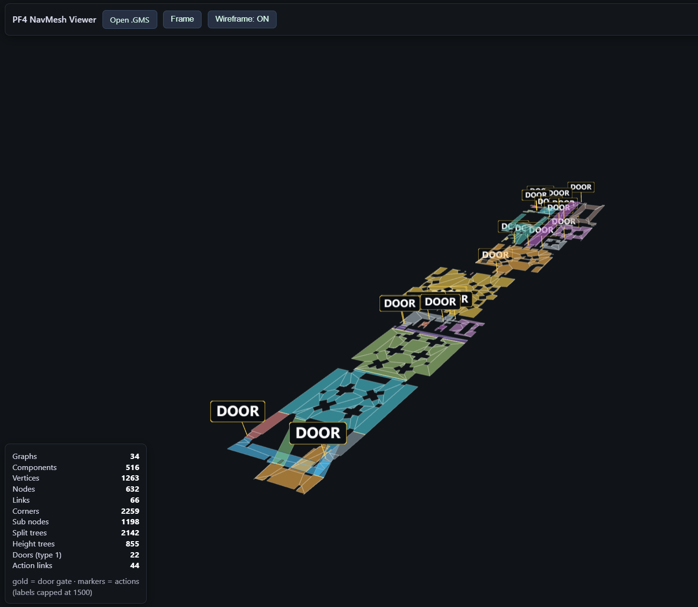

# PF4 NavMesh Viewer

Standalone HTML5 viewer for the **PF4 (pathfinder4)** navmesh chunk stored inside
Hitman: Blood Money `.GMS` level files.



## Quick start

Or serve it via npm

```bash
npm start      # uses `python -m http.server 8000`
npm run serve  # uses `npx http-server` (auto-downloads on first run)
```

then open http://localhost:8000

## What it does

1. Reads the GMS container the same way the reference dumper does:
   - header `i32 uncompressedSize, i32 bufferSize, i8 notCompressed`
   - the payload is raw-deflate (`wbits=-15`) unless already uncompressed
   - `u32` at payload offset `0x34` points to the PF4 chunk (`u32 size` + data)
2. Parses the PF4 block using the layout reversed from the PC binary
   (`SPF4DataBlock` header + packed arrays):
   `splitTrees, heightTrees, planeEquations, components, graphs, nodes,
    vertices, links, exitDists, corners, subNodes, staticObstacleIds,
    staticObstacles`
3. Renders every walkable component polygon in 3D (vertex heights included),
   colored per graph, with wireframes, orbit camera and click-to-inspect.

## UI

- **Open .GMS** — file picker (also supports drag & drop anywhere on the page)
- **Frame** — refit the camera to the mesh
- **Wireframe** — toggle cell outlines
- **components / links / actions** — show/hide component cells, plain link lines
  and door/action overlays
- Bottom-left panel shows the array counts of the loaded chunk (plus door /
  action link counts when present)
- Click a cell to inspect its graph summary

## Doors & actions

PF4 links carry `type`, `action`, `keyMask` and a door controller reference. The
overlay derives from the reversed runtime code:

- **gold segments** — `type == 1` door links. Their `action` field is the
  divider/corner index of the door's component, so the exact gate line across the
  component polygon is drawn (same logic as the path reconstruction).
- **colored markers + labels** — non-door links whose `action` maps to an
  `EPathWayActions` value (CLIMB / FALL / JUMP / WALK / RAPEL / DOOR / elevator
  enter-exit). Labels are capped at 1500 to keep huge levels responsive.
- To avoid double drawing, only physical link entries that appear inside a
  node's `firstLink..lastLink` range are used, deduplicated by link index.

Colors: `DOOR` gold · `CLIMB` red · `JUMP` orange · `WALK` green ·
`FALL`/`RAPEL`/elevator blue-violet family; normal link lines are faint blue.

## Notes

- Only the navigation data is shown; no level geometry/assets are used.
- The `.GMS` file must contain a PF4 chunk with a **normal** header (the
  `0xFFFFFFFC` chained-chunk case is reported as an error).
- Local copies of the viewer libraries:
  `three.js r128` (UMD), its `OrbitControls`, and `pako` inflate.

## Reference

- Data layout: `ZData::LoadDataBlock` in `ReHitman/Glacier/source/PF4/ZData.cpp`.
